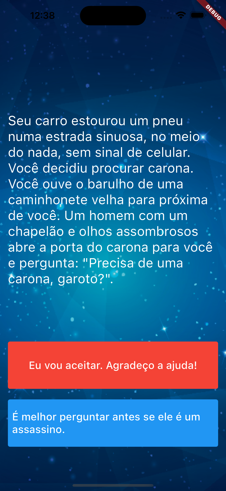
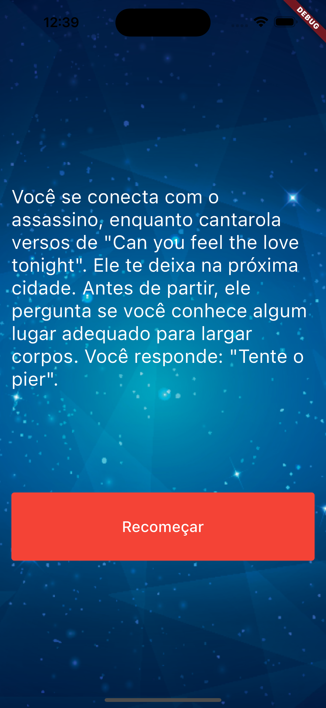

# Adventure - Template

Vamos construir um aplicativo do tipo "Escolha sua aventura".

Siga as instruções a seguir para o desenvolvimento:
1. Clone o repositório da tarefa do github classroom.
1. Faça com que seu aplicativo seja um `StatelessWidget` de nome qualquer, que retorne um `MaterialApp` com `body` de um `StatefulWidget`. Chame este widget de `StoryPage`.
1. Monte o leiaute do programa conforme a imagem a seguir, baseando-se também no projeto da aula. Uma imagem de background foi inserida na pasta `images`. Lembre-se de configurar o `pubspec.yaml` para importar o asset de imagem corretamente.

1. Crie um arquivo novo: story.dart. Você já tem o story_brain.dart no código base
1. O arquivo `story.dart` é uma classe simples (como o question.dart do aplicativo de perguntas), de nome Story, que contêm 3 atributos: `storyTitle`, `choice1` e `choice2`.
1. Faça com que o construtor da classe inicialize todos os 3 atributos. Note que seu construtor deve ter os parâmetros nomeados (caso não se lembre como fazê-lo, veja este [link](https://alvinalexander.com/flutter/dart-class-constructor-named-parameters-example/)). Por fim, as próximas instruções vão dar a idéia da ordem dos parâmetros deste construtor.
1. O arquivo `story_brain.dart` deve conter uma classe de nome `StoryBrain`. Essa classe deve conter dois atributos privados: `storyNumber` e `storyData`. Os valores de `storyData` já estão incluídos no arquivo.
1. A classe `StoryBrain` também deve conter três métodos para obter os valores de `storyTitle`, `choice1` e `choice2`, de um objeto de `Story` (lembre dos métodos que criamos no exercício do quiz. Os métodos devem se chamar `getStory`, `getChoice1` e `getChoice2`. Eles devem retornar os valores de `storyTitle`, `choice1` e `choice2` para o item de `storyData`, na posição `storyNumber`.
1. A classe `StoryBrain` deve conter um método `restart`, que deve setar `storyNumber` para `0`
1. A classe `StoryBrain` deve conter um método `isChoice2Available`, que verifica se existe uma `choice2` na história (e vai fazer com que o segundo botão da tela fique invisível, mais sobre isso nas próximas instruções). Existe uma `choice2` caso o valor de `storyNumber` seja inferior a `3`.
1. Por fim, crie o método `nextStory`, na classe `StoryBrain`. Ele deve receber um parâmetro `int`, que é o número da opção do usuário (será `1`, ou `2`, uma vez que cada `story` tem duas opções). Você deve atualizar o valor de `storyNumber` conforme o guia no arquivo [Story-Plan.pdf](Story-Plan.pdf), anexo nesta tarefa. Note que, caso o `storyNumber` seja: `3`, `4`, ou `5`, e o usuário clique no botão "Reinicio", o método `restart` deve ser chamado (e o jogo recomeça).
1. Agora que as classes fundamentais estão prontas, você deve voltar ao `main.dart`. Primeiro, crie um objeto de `StoryBrain`, como atributo da classe `StoryPageState`. Lembre-se que você deve inicializá-lo. (fizemos o mesmo no quiz...)
1. Agora, onde você lê `'O texto da história vem aqui'`, você deve usar o objeto de `StoryBrain` e seu método `getStory` para atribuir o texto ao widget `Text`.
1. Nos dois `TextButton`, onde você lê `'Texto da opção X'`, você deve substituir, respectivamente pelas chamadas aos métodos `getChoice1` e `getChoice2`, da classe `StoryBrain`.
1. Por fim, nas chamadas de `onPressed`, de cada um dos botões, faça com que o método `nextStory` seja chamado, passando por parâmetro 1, para o botâo da opção 1 e 2 para o botão da opção 2. Lembre-se de que há algo EXTRA que deve ser feito para que a interface seja atualizada conforme o ESTADO da aplicação muda.
1. Execute seu aplicativo e verifique o fluxo das histórias.
1. Você deve entregar seu aplicativo através de um repositório git, gerado para você ao aceitar a tarefa no github classroom. 

NÃO SE ESQUEÇA DE POSTAR O REPOSITÓRIO NA TAREFA DO TEAMS. SEM ELE NÃO SERÁ POSSÍVEL AVALIAR SEU ENVIO.
